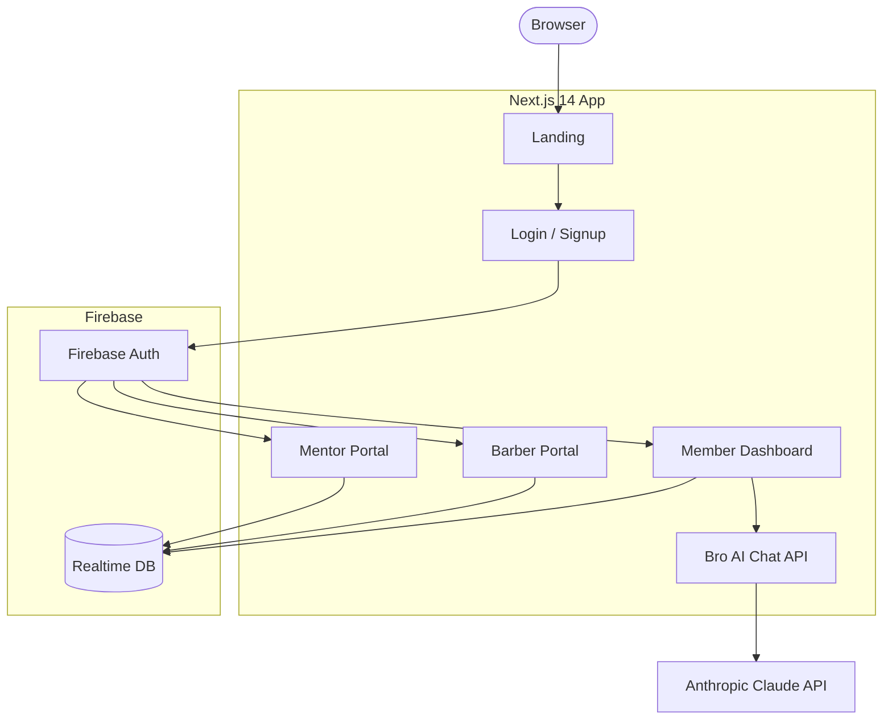
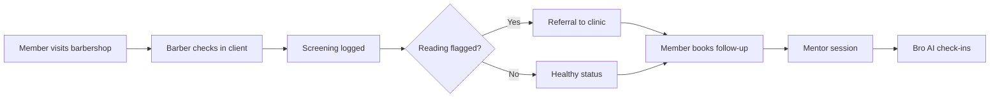
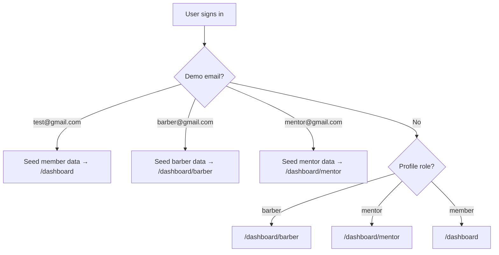
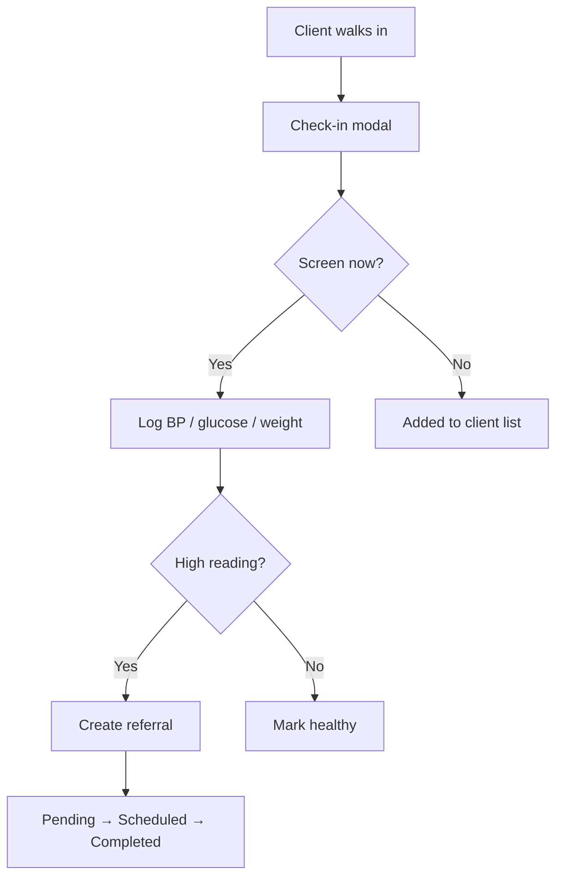

<div align="center">


# BRO2BRO

**Barbershop-rooted health technology for Black men in Arkansas.**

UAMS AI & HealthTech Hackathon · Team 7

[](https://nextjs.org)
[](https://typescriptlang.org)
[](https://firebase.google.com)

</div>

---

## What it is

BRO2BRO uses the barbershop as a trusted health checkpoint. Barbers log screenings and referrals; members follow up with AI support, appointments, and peer mentors.

| Audience | Portal | Highlights |
|---|---|---|
| **Member** | `/dashboard` | Bro AI chat, appointments, mentors, resources, community forum, profile + photo upload |
| **Barber / CHW** | `/dashboard/barber` | Client check-in, BP screenings, referrals, CHW training, events |
| **Mentor** | `/dashboard/mentor` | Mentees, sessions, messages, mentor settings |

---

## Demo accounts

Sign in only (do not sign up with these emails). Mock data seeds on first login.

| Role | Email | Password | Portal |
|---|---|---|---|
| Member | `test@gmail.com` | `test123@` | `/dashboard` |
| Barber | `barber@gmail.com` | `barber123@` | `/dashboard/barber` |
| Mentor | `mentor@gmail.com` | `mentor123@` | `/dashboard/mentor` |

**Connected demo story:** Marcus J. (member) = Marcus Williams (barber client) = Raymond T.'s mentee (mentor). Screen at Joe's Classic Cuts → follow-up on member app → mentor check-ins.

---

## Architecture



---

## User flows

### End-to-end journey



### Auth and routing



### Barber visit (detail)



---

## Tech stack

Next.js 14 · TypeScript · Tailwind CSS · Radix UI · Firebase Auth · Firebase Realtime Database · Firebase Storage · Anthropic Claude · Leaflet · Twilio

---

## Getting started

**Prerequisites:** Node.js 18+, Firebase project (Auth + Realtime Database), Anthropic API key.

```bash
git clone https://github.com/Lincolntinodaishe/BRO2BRO.git
cd BRO2BRO
npm install
cp .env.example .env.local   # fill in Firebase + Anthropic keys
npm run dev                  # http://localhost:3000
```

### Environment variables

```env
ANTHROPIC_API_KEY=sk-ant-...
NEXT_PUBLIC_FIREBASE_API_KEY=...
NEXT_PUBLIC_FIREBASE_AUTH_DOMAIN=your-project.firebaseapp.com
NEXT_PUBLIC_FIREBASE_DATABASE_URL=https://your-project-default-rtdb.firebaseio.com
NEXT_PUBLIC_FIREBASE_PROJECT_ID=your-project
NEXT_PUBLIC_FIREBASE_STORAGE_BUCKET=your-project.appspot.com
NEXT_PUBLIC_FIREBASE_MESSAGING_SENDER_ID=...
NEXT_PUBLIC_FIREBASE_APP_ID=...
TWILIO_ACCOUNT_SID=...
TWILIO_AUTH_TOKEN=...
TWILIO_PHONE_NUMBER=+1...
```

### Firebase Realtime Database rules

```json
{
  "rules": {
    "users": {
      "$uid": {
        ".read": "$uid === auth.uid",
        ".write": "$uid === auth.uid"
      }
    },
    "community": {
      "posts": {
        ".read": "auth != null",
        ".write": "auth != null"
      }
    }
  }
}
```

### Firebase Storage rules

```
rules_version = '2';
service firebase.storage {
  match /b/{bucket}/o {
    match /photos/{uid}/{allPaths=**} {
      allow read, write: if request.auth != null && request.auth.uid == uid;
    }
  }
}
```

Enable **Email/Password** and **Google** sign-in in Firebase Console.

---

## Data model

All user data under `users/{uid}/` in Realtime Database:

| Path | Used by |
|---|---|
| `profile/` | All roles |
| `appointments/` | Member |
| `barber/clients`, `screenings`, `referrals`, `modules` | Barber |
| `mentor/mentees`, `sessions`, `messages` | Mentor |

---

## Project layout

```
app/
  page.tsx                 # Landing
  (auth)/login, signup
  dashboard/               # Member portal
  dashboard/barber/        # Barber portal
  dashboard/mentor/        # Mentor portal
  api/chat/                # Bro AI
components/dashboard/      # Sidebars, header, map
lib/                       # Auth, stores, demo data, search
middleware.ts              # Session cookie guard
```

---

## Bro AI

The chat assistant at `/dashboard/chat` can book or cancel appointments, explain vitals, surface nearby resources, and answer wellness questions in plain language.

---

<div align="center">

**Team 7 · UAMS AI & HealthTech Hackathon**


</div>
