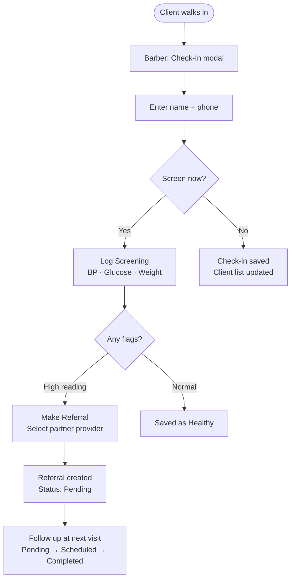
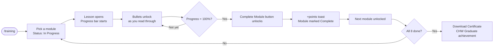
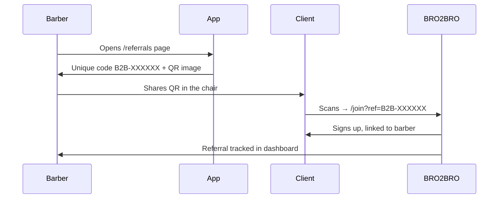
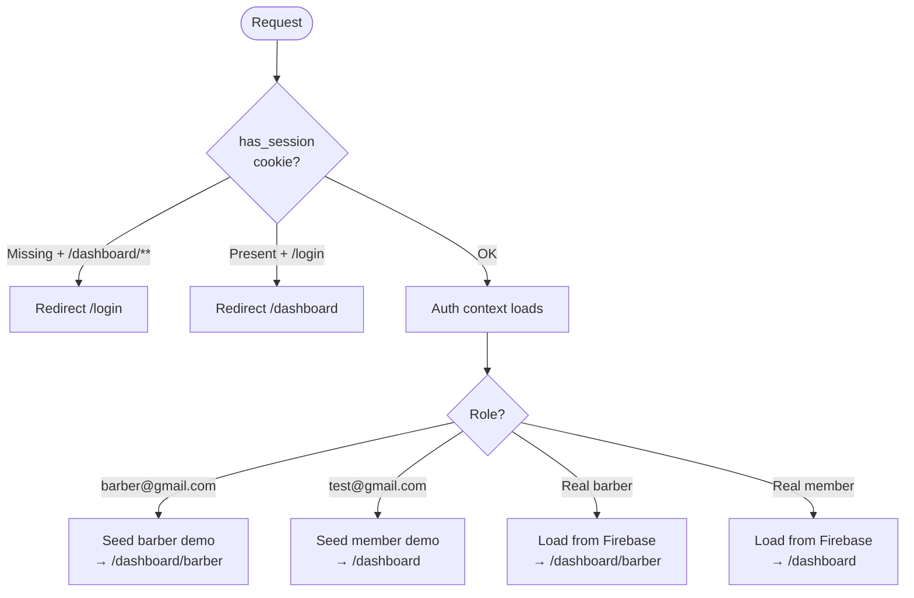

<div align="center">


# BRO2BRO

**Barbershop-rooted health technology for Black men in Arkansas.**

Built at the UAMS AI & HealthTech Hackathon · Team 7

[](https://nextjs.org)
[](https://typescriptlang.org)
[](https://firebase.google.com)
[](https://anthropic.com)

</div>

---

## What is BRO2BRO?

BRO2BRO turns the barbershop chair into a health checkpoint. The barbershop is one of the most trusted spaces for Black men — a place where real conversations happen. We built on that trust.

**For community members** — a digital health companion that books appointments, answers health questions through AI, and connects them to local providers and mentors.

**For barbers** — a CHW (Community Health Worker) portal that lets them log screenings, track clients, make referrals, and earn certifications without leaving their chair.

---

## Table of Contents

- [How It Works](#how-it-works)
- [User Roles](#user-roles)
- [Screens & Features](#screens--features)
- [Architecture](#architecture)
- [User Flow Diagrams](#user-flow-diagrams)
- [Data Model](#data-model)
- [Tech Stack](#tech-stack)
- [Getting Started](#getting-started)
- [Demo Accounts](#demo-accounts)
- [Environment Variables](#environment-variables)
- [Project Structure](#project-structure)
- [Sponsors & Team](#sponsors--team)

---

## How It Works

```
1. A member visits a barbershop partner.
2. The barber checks them in using the BRO2BRO app.
3. The barber logs a quick BP / glucose / BMI screening.
4. If flags are detected → one-click referral to a partner clinic.
5. The member gets a BRO2BRO account → books follow-up, chats with Bro AI.
6. The barber earns CHW training credits for every completed screening.
```

---

## User Roles

| Role | Portal | Description |
|---|---|---|
| **Member** | `/dashboard` | Community member — appointments, AI chat, resources |
| **Barber / CHW** | `/dashboard/barber` | Certified barber — client check-in, screenings, referrals, training |
| Mentor | _(coming soon)_ | Health mentor matched to members |
| Provider | _(coming soon)_ | Clinical partner receiving referrals |
| Family | _(coming soon)_ | Family health dashboard |

---

## Screens & Features

### Landing Page (`/`)

Full marketing site with animated hero, how-it-works walkthrough, live community stats (CountUp.js), role-based CTAs, FAQ accordion, and partner logos. Navbar has active-section tracking and smooth scroll.

---

### Auth (`/login`, `/signup`)

- Split-panel layout — full-bleed looping background video on the left, form on the right
- **Login**: email + password or Google OAuth — `bbshop.mp4` background
- **Signup**: same options + 5-role selector, terms checkbox — `bbshoptalk.mp4` background
- Middleware-based session cookie guards all `/dashboard/**` routes

---

### Member Dashboard

| Page | What You Get |
|---|---|
| **Home** `/dashboard` | Health score card, upcoming appointments, quick-action buttons, Bro AI shortcut |
| **Bro AI** `/dashboard/chat` | Natural language health coach — creates/cancels appointments, answers questions, finds local resources |
| **Appointments** `/dashboard/appointments` | Full list with status badges, create / reschedule / cancel flows |
| **Mentors** `/dashboard/mentors` | Browse mentors by specialty, send connection request |
| **Community** `/dashboard/community` | Events calendar, community feed, Barbershop Talk announcements |
| **Resources** `/dashboard/resources` | Resource library + interactive Leaflet map of local health providers |
| **Settings** `/dashboard/settings` | Profile, notifications, privacy |

---

### Barber / CHW Portal

| Page | What You Get |
|---|---|
| **Overview** `/dashboard/barber` | Daily stats (clients, screenings, referrals, points), today's client list, latest screenings, CHW module progress strip |
| **Clients** `/dashboard/barber/clients` | Full client roster, search + filter, check-in modal, client drawer with visit history |
| **Screenings** `/dashboard/barber/screenings` | Log BP, glucose, and weight — auto-flags high readings, one-click referral from any screening |
| **Referrals** `/dashboard/barber/referrals` | Full referral pipeline (Pending → Scheduled → Completed), unique QR referral code per barber |
| **Training** `/dashboard/barber/training` | 8-module CHW curriculum — interactive lesson player, progress bar, points earned, achievements, certificate download |
| **Events** `/dashboard/barber/events` | Upcoming Barbershop Talks, CHW trainings, health fairs — register with live seat tracking |
| **Settings** `/dashboard/barber/settings` | Shop profile, notification preferences |

---

## Architecture

```mermaid
graph TB
    subgraph Client["Next.js 14 App (Vercel)"]
        LP[Landing Page]
        AUTH[Auth\nLogin · Signup]
        MD[Member Dashboard]
        BP[Barber Portal]
    end

    subgraph Firebase
        FA[Firebase Auth\nEmail · Google]
        RTDB[(Realtime Database\nusers/{uid}/...)]
    end

    subgraph AI
        CLAUDE[Anthropic API\nclaude-sonnet-4-6]
    end

    subgraph Guard
        MW[Next.js Middleware\nhas_session cookie]
    end

    USER([User]) --> LP
    LP --> AUTH
    AUTH --> FA
    FA --> MW
    MW --> MD & BP
    MD & BP --> RTDB
    MD --> CLAUDE
```

---

## User Flow Diagrams

### Member Onboarding

```mermaid
flowchart LR
    A([Visit bro2bro.app]) --> B{Has account?}
    B -- No --> C[Sign Up\nChoose: Member]
    B -- Yes --> D[Log In]
    C --> E{Auth method?}
    E -- Google --> F[OAuth popup]
    E -- Email --> G[Email + password]
    F & G --> H[/dashboard]
    D --> H
    H --> I[AI health check-in\nvia Bro AI]
    I --> J[Appointment created\nor resource found]
```

---

### Barber Client Visit



---

### CHW Training & Certification



---

### Referral Code Sharing



---

### Auth & Route Guard



---

## Data Model

All persistent data lives under `users/{uid}/` in Firebase Realtime Database.

```
users/
  {uid}/
    profile/
      role:         "member" | "barber" | ...
      shopName:     string
      displayName:  string
    appointments/
      {id}/         Appointment object
    barber/
      clients/
        {id}/       BarberClient
      screenings/
        {id}/       BarberScreening
      referrals/
        {id}/       BarberReferral
      modules/
        {id}/       BarberTrainingModule
```

### Key Types

```typescript
// Member
type Appointment = {
  id: string; title: string; provider: string; providerType: string;
  date: string; time: string; location: string; status: AppointmentStatus;
}

// Barber
type BarberClient = {
  id: string; name: string; age?: number; phone: string;
  bp: string; status: ClientStatus; visits: number; lastVisit: string;
}

type BarberScreening = {
  id: string; name: string; date: string;
  bp: string; bpFlag: BpFlag;
  glucose: number; glucoseFlag: GlucoseFlag;
  weight: number; bmi: number; referred: boolean;
}

type BarberReferral = {
  id: string; clientName: string; provider: string;
  reason: string; status: ReferralStatus; urgency: "routine" | "urgent";
}

type BarberTrainingModule = {
  id: string; title: string; status: ModuleStatus;
  progress: number; points: number; category: string; duration: string;
}
```

---

## Tech Stack

| Layer | Tool |
|---|---|
| Framework | Next.js 14 (App Router) |
| Language | TypeScript 5 |
| Styling | Tailwind CSS |
| Components | Radix UI + custom CVA variants |
| Icons | Lucide React |
| Auth | Firebase Auth (Email/Password, Google OAuth) |
| Database | Firebase Realtime Database |
| AI | Anthropic Claude API (`claude-sonnet-4-6`) |
| Map | Leaflet.js |
| QR Codes | `api.qrserver.com` (CDN, no install needed) |
| Deployment | Vercel |

---

## Getting Started

### Prerequisites

- Node.js 18+
- Firebase project with **Auth** and **Realtime Database** enabled
- Anthropic API key

### Install

```bash
git clone https://github.com/your-org/Team-7-Hackathon-Repo.git
cd Team-7-Hackathon-Repo
npm install
```

### Configure environment

```bash
cp .env.example .env.local
# Open .env.local and fill in your values
```

### Run locally

```bash
npm run dev
# → http://localhost:3000
```

### Build for production

```bash
npm run build
npm start
```

---

## Demo Accounts

Two ready-to-use accounts for demos and judging. No setup needed — data is seeded on first sign-in.

| Account | Email | Password | Portal |
|---|---|---|---|
| **Member Demo** | `test@gmail.com` | `test123@` | `/dashboard` |
| **Barber Demo** | `barber@gmail.com` | `barber123@` | `/dashboard/barber` |

> Demo accounts seed realistic mock data on first sign-in (only if the Firebase node is empty). All interactions — adding clients, logging screenings, completing training modules — work in full within the session.

---

## Environment Variables

Create `.env.local` at the project root:

```env
# AI (Bro AI chat)
ANTHROPIC_API_KEY=sk-ant-...

# Firebase (client-visible — security enforced via Firebase Auth UID rules)
NEXT_PUBLIC_FIREBASE_API_KEY=...
NEXT_PUBLIC_FIREBASE_AUTH_DOMAIN=your-project.firebaseapp.com
NEXT_PUBLIC_FIREBASE_DATABASE_URL=https://your-project-default-rtdb.firebaseio.com
NEXT_PUBLIC_FIREBASE_PROJECT_ID=your-project
NEXT_PUBLIC_FIREBASE_STORAGE_BUCKET=your-project.appspot.com
NEXT_PUBLIC_FIREBASE_MESSAGING_SENDER_ID=...
NEXT_PUBLIC_FIREBASE_APP_ID=...
NEXT_PUBLIC_FIREBASE_MEASUREMENT_ID=G-...
```

### Firebase Realtime Database Rules

```json
{
  "rules": {
    "users": {
      "$uid": {
        ".read": "$uid === auth.uid",
        ".write": "$uid === auth.uid"
      }
    }
  }
}
```

### Firebase Setup Checklist

- [ ] Enable **Email/Password** sign-in
- [ ] Enable **Google** sign-in
- [ ] Create a **Realtime Database** (choose your region)
- [ ] Apply the security rules above

---

## Project Structure

```
bro2bro/
├── app/
│   ├── page.tsx                        # Landing page
│   ├── (auth)/
│   │   ├── login/page.tsx              # Login — video bg, email + Google
│   │   └── signup/page.tsx             # Signup — role selector
│   ├── dashboard/
│   │   ├── layout.tsx                  # Member layout
│   │   ├── page.tsx                    # Member home
│   │   ├── chat/page.tsx               # Bro AI chatbot
│   │   ├── appointments/page.tsx
│   │   ├── mentors/page.tsx
│   │   ├── community/page.tsx
│   │   ├── resources/page.tsx          # Provider map (Leaflet)
│   │   ├── settings/page.tsx
│   │   └── barber/
│   │       ├── layout.tsx              # Barber layout + route guard
│   │       ├── page.tsx                # Barber overview
│   │       ├── clients/page.tsx        # Check-in + roster
│   │       ├── screenings/page.tsx     # Health screening log
│   │       ├── referrals/page.tsx      # Referral pipeline + QR code
│   │       ├── training/page.tsx       # CHW curriculum + points
│   │       ├── events/page.tsx         # Barbershop Talks + health events
│   │       └── settings/page.tsx
│
├── components/
│   ├── brand-logo.tsx
│   ├── count-up.tsx
│   ├── dashboard/
│   │   ├── sidebar.tsx                 # Member nav (collapsible)
│   │   ├── barber-sidebar.tsx          # Barber nav (amber branding)
│   │   ├── header.tsx                  # Top bar + profile dropdown
│   │   └── resource-map.tsx            # Leaflet provider map
│   └── ui/
│       ├── avatar.tsx
│       ├── badge.tsx
│       ├── button.tsx                  # CVA variants (gold, ghost, etc.)
│       ├── card.tsx
│       ├── input.tsx
│       └── tabs.tsx
│
├── lib/
│   ├── firebase.ts                     # Firebase init + guards
│   ├── auth-context.tsx                # AuthProvider
│   ├── auth-routes.ts                  # canAccessBarberPortal
│   ├── demo-account.ts                 # Demo email constants
│   ├── demo-barber-data.ts             # All barber types + mock datasets
│   ├── barber-store.ts                 # Firebase RTDB reads/writes
│   ├── barber-data-context.tsx         # BarberDataProvider context
│   ├── use-barber-data.ts              # Re-export hook
│   ├── appointments-store.ts           # Member appointments RTDB
│   └── utils.ts                        # cn()
│
├── middleware.ts                        # Cookie-based route guard
└── brand_assets/                        # Logos, color guides
```

---

## Bro AI Capabilities

The AI assistant (`/dashboard/chat`) understands plain language and takes real action:

| What You Say | What Happens |
|---|---|
| "Book a blood pressure check for Tuesday" | Creates an appointment |
| "Cancel my Friday appointment" | Updates status to cancelled |
| "What does 135/88 mean?" | Explains the reading |
| "Where can I get a free diabetes screening?" | Returns local providers from map data |
| "Sign me up for the barbershop talk" | Registers for the next event |
| "What appointments do I have this week?" | Lists upcoming items |

---

## Sponsors & Team

<div align="center">

**Team 7 · UAMS AI & HealthTech Hackathon**


*Built with the support of UAMS, the Barbershop Talk program, and the UA Little Rock community.*

</div>
